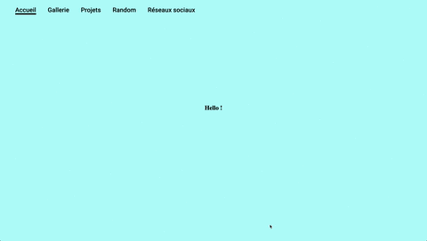

# Introduction HTML / CSS / JS / gh-pages - Construire un portfolio

This repo is an introduction to HTML CSS and JS to build a portfolio for designers and deploy it to gh-pages.

Pour avoir un premier aperçu de ce que sont le HTML, le CSS et le JS vous pouvez jeter un oeil à cette vidéo si vous êtes totalement néophytes - une démonstration valant mieux q'une longue explication.

https://makerslab.em-lyon.com/skills.html#web-coding


Pour résumer HTML permet de définir le contenu d'une page, CSS la mise en forme et JS permet d'ajouter de l'interactivité et / ou de manipuler le contenu et la mise en forme dynamiquement. 

Dans la plupart des sites vous aurez donc trois fichiers :
- *index.html* le contenu de votre page web.
- *style.css* les règles de style qui s'appliqueront.
- *script.js* qui définiera tout le reste.

Dans ce dépot nous allons expliquer un type de mise en forme qui couvrira un certain nombre de cas d'usages, mais si vous souhaitez personaliser plus en détail votre site vous devrez effectuer des recherches supplémentaires.

Vous pourrez aussi avoir besoin de didacticiels détailles sur les différents composants de chaque langage :
https://www.w3schools.com/html/
https://www.w3schools.com/css/
https://www.w3schools.com/js/

Vous pourrez retrouver la référence officielle des trois langages à ces adresses : 
https://developer.mozilla.org/fr/docs/Web/HTML
https://developer.mozilla.org/fr/docs/Web/CSS
https://developer.mozilla.org/fr/docs/Web/JavaScript#R%C3%A9f%C3%A9rence

Vous pouvez effectuer des recherches aussi sur ce forum :
https://css-tricks.com/


## Contenu

* [Templating avec HTML et CSS](#Templating-avec-HTML-et-CSS)
    * [Sections et scrolling](#sections-et-scrolling)
        * [Anatomie du squelette HTML](Anatomie-du-squelette-HTML)
            * [header](#Header)
            * [body](#Body)
        * [Ajouter notre navigation avec JS](#Ajouter-notre-navigation-avec-JS)
        * [Ajouter du style avec CSS](#Ajouter-du-style-avec-CSS)


* [Mise en ligne avec github-pages](#Mise-en-ligne-avec-github-pages)


* [Javascript](#Javascript)


---
## Templating avec HTML et CSS

Dans cette première section nous allons nous attacher à mettre en place le squelette de notre site avec HTML et CSS et un tout petit peu de javascript.

### Sections et scrolling (navbar)

Commençons par mettre en place le système de navigation. L'objectif est d'arriver à ce résultat :


https://b2renger.github.io/Introduction_HTML-CSS-JS/step_00_sections_final/

Nous allons donc commencer par définir notre page HTML.


#### Anatomie du squelette HTML 

Toute page HTML doit commencer par ces instructions : 

```html
<!DOCTYPE html>
<html lang="fr">
```

##### Header
A la suite nous allons définir la partie **header** qui contient des informations essentielles pour les navigateurs :

``` html
<head>
  <meta charset="UTF-8">
  <meta name="viewport" content="width=device-width, initial-scale=1.0">
  <meta http-equiv="X-UA-Compatible" content="ie=edge">
</head>
```

Puis dans ce *header* nous pouvons ajouter différentes balises pour ajouter des éléments ces instructions sont à taper **après** les balises *meta* et **avant** la *balise fermante de header* (</head>) :

- Tout d'abord un titre avec la balise **title** :

    ```html
    <title>Great Stuff</title>
    ```
    Pour plus d'infos : https://developer.mozilla.org/fr/docs/Web/HTML/Element/title
    
 - Puis un favicon (le petit icone qui s'affiche sur les onglets de votre navigateur) :

    ```html
    <link rel="icon" type="image/x-icon" href="./favicon.ico">
    ```

- et enfin un lien vers un fichier CSS (pour l'instant vide) :

    ```html
    <link rel="stylesheet" href="./style.css">
    ```
    Pour plus d'infos : https://developer.mozilla.org/fr/docs/Web/HTML/Element/link


Félicitations votre page à maintenant un titre et un favicon !

[**home**](#Contenu)

#### Body

Le body va être le corps de notre page et c'est ici que nous allons ajouter le contenu. Il est encadré par deux balises :

```html
<body>
<!-- le contenu va être ajouté ici -->
</body>
```

Nous allons maintenant créer une liste d'élements à l'aide des balises [**ul**](https://developer.mozilla.org/fr/docs/Web/HTML/Element/ul) et [**li**](https://developer.mozilla.org/fr/docs/Web/HTML/Element/li). Ces éléments correspondront plus tard aux différentes catégories de notre site.

```html
  <ul>
    <li> Accueil</li>
    <li> Gallerie</li>
    <li> Projets</li>
    <li> Random</li>
    <li> Réseaux sociaux</li>
  </ul>
```
et voilà nous avons une première page web assez rudimentaire.


[**home**](#Contenu)

#### Ajouter notre navigation avec JS et CSS

Nous allons maintenant ajouter un peu d'interaction et faire en sorte que lorsque l'on clique sur un des élements de la liste nous puissions naviguer vers une autre partie du site.


https://github.com/nichenqin/wall.js


[**home**](#Contenu)

#### Ajouter du style avec CSS


https://www.w3schools.com/css/css_display_visibility.asp


[**home**](#Contenu)


### Ajouter du contenu aux sections (balises html classiques et css)

[**home**](#Contenu)

### Ajouter une gallerie photo (navbar secondaire propre à une section et setInterval)

[**home**](#Contenu)

### Construire des cards

[**home**](#Contenu)

#### Ouvrir une modal en cliquant sur une card

[**home**](#Contenu)

#### Ouvrir une autre page en cliquant sur une card

[**home**](#Contenu)

### Ajouter une animation en fond 

#### Avec cablesgl

[**home**](#Contenu)

#### Avec p5js

[**home**](#Contenu)

### Limitations de ce modèle

[**home**](#Contenu)

---
## Mise en ligne avec gh-pages

[**home**](#Contenu)

### repo principal

[**home**](#Contenu)

### repos secondaires

[**home**](#Contenu)


---
## Utiliser json et js pour générer du html

[**home**](#Contenu)

### de manière synchrone : injection

[**home**](#Contenu)

### de manière asynchrone avec nodejs : génération

[**home**](#Contenu)


