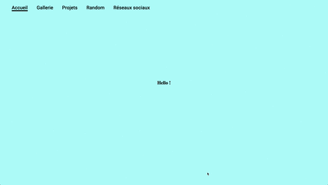
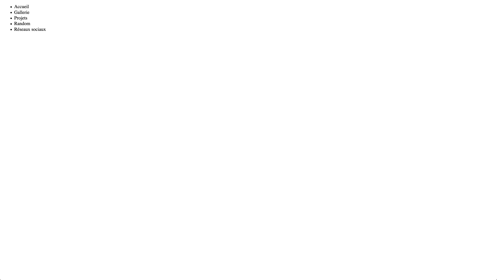
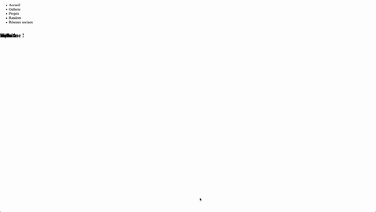

# Introduction HTML / CSS / JS / gh-pages - Construire un portfolio

This repo is an introduction to HTML CSS and JS to build a portfolio for designers and deploy it to gh-pages.

Pour avoir un premier aperçu de ce que sont le HTML, le CSS et le JS vous pouvez jeter un oeil à cette vidéo si vous êtes totalement néophytes - une démonstration valant mieux q'une longue explication.

https://makerslab.em-lyon.com/skills.html#web-coding


Pour résumer HTML permet de définir le contenu d'une page, CSS la mise en forme et JS permet d'ajouter de l'interactivité et / ou de manipuler le contenu et la mise en forme dynamiquement. 

Dans la plupart des sites vous aurez donc trois fichiers :
- *index.html* le contenu de votre page web.
- *style.css* les règles de style qui s'appliqueront.
- *script.js* qui définiera tout le reste.

Dans ce dépot nous allons expliquer un type de mise en forme qui couvrira un certain nombre de cas d'usages, mais si vous souhaitez personaliser plus en détail votre site vous devrez effectuer des recherches supplémentaires.

Vous pourrez aussi avoir besoin de didacticiels détailles sur les différents composants de chaque langage :
https://www.w3schools.com/html/
https://www.w3schools.com/css/
https://www.w3schools.com/js/

Vous pourrez retrouver la référence officielle des trois langages à ces adresses : 
https://developer.mozilla.org/fr/docs/Web/HTML
https://developer.mozilla.org/fr/docs/Web/CSS
https://developer.mozilla.org/fr/docs/Web/JavaScript#R%C3%A9f%C3%A9rence

Vous pouvez effectuer des recherches aussi sur ce forum :
https://css-tricks.com/


## Contenu

* [Templating avec HTML et CSS](#Templating-avec-HTML-et-CSS)
    * [Sections et scrolling](#sections-et-scrolling)
        * [Anatomie du squelette HTML](Anatomie-du-squelette-HTML)
            * [header](#Header)
            * [body](#Body)
        * [Ajouter notre navigation](#Ajouter-notre-navigation)
          * [Ajouter une bibliothèque JS](#Ajouter-une-bibliothèque-JS)
          * [Ajouter un peu de contenu HTML](#Ajouter-un-peu-de-contenu-HTML)
          * [Ajouter un peu de mise en forme](#Ajouter-un-peu-de-mise-en-forme)
        * [Pousser la mise en forme](#Pousser-la-mise-en-forme)
          * [Ajouter une font](#Ajouter-une-font)
          * [Modifier le look de notre menu](#Modifier-le-look-de-notre-menu)
          * [Ajouter de l'interaction et des transitions](#Ajouter-des-transitions)


* [Mise en ligne avec github-pages](#Mise-en-ligne-avec-github-pages)


* [Javascript](#Javascript)


---
## Templating avec HTML et CSS

Dans cette première section nous allons nous attacher à mettre en place le squelette de notre site avec HTML et CSS et un tout petit peu de javascript.

### Sections et scrolling (navbar)

Commençons par mettre en place le système de navigation. L'objectif est d'arriver à ce résultat :



https://b2renger.github.io/Introduction_HTML-CSS-JS/step_00_sections_final/

Nous allons donc commencer par définir notre page HTML.


#### Anatomie du squelette HTML 

Toute page HTML doit commencer par ces instructions : 

```html
<!DOCTYPE html>
<html lang="fr">
<!-- webpage -->
</html>
```

##### Header

Entre la **balise html ouvrante** <html> et la **balise html fermante** </html> nous allons définir la partie **header** qui contient des informations essentielles pour les navigateurs :

``` html
<head>
  <meta charset="UTF-8">
  <meta name="viewport" content="width=device-width, initial-scale=1.0">
  <meta http-equiv="X-UA-Compatible" content="ie=edge">
</head>
```

Puis dans ce *header* nous pouvons ajouter différentes balises pour ajouter des éléments ces instructions sont à taper **après** les balises *meta* et **avant** la *balise fermante de header* (</head>) :

- Tout d'abord un titre avec la balise **title** :

    ```html
    <title>Great Stuff</title>
    ```
    Pour plus d'infos : https://developer.mozilla.org/fr/docs/Web/HTML/Element/title
    
 - Puis un favicon (le petit icone qui s'affiche sur les onglets de votre navigateur) :

    ```html
    <link rel="icon" type="image/x-icon" href="./favicon.ico">
    ```

- et enfin un lien vers un fichier CSS (pour l'instant vide) :

    ```html
    <link rel="stylesheet" href="./style.css">
    ```
    Pour plus d'infos : https://developer.mozilla.org/fr/docs/Web/HTML/Element/link


Félicitations votre page à maintenant un titre et un favicon !

[**home**](#Contenu)

#### Body

Le body va être le corps de notre page et c'est ici que nous allons ajouter le contenu. Il est encadré par deux balises :

```html
<body>
<!-- le contenu va être ajouté ici -->
</body>
```

Nous allons maintenant créer une liste d'élements à l'aide des balises [**ul**](https://developer.mozilla.org/fr/docs/Web/HTML/Element/ul) et [**li**](https://developer.mozilla.org/fr/docs/Web/HTML/Element/li). Ces éléments correspondront plus tard aux différentes catégories de notre site.

```html
  <ul>
    <li> Accueil</li>
    <li> Gallerie</li>
    <li> Projets</li>
    <li> Random</li>
    <li> Réseaux sociaux</li>
  </ul>
```
et voilà nous avons une première page web assez rudimentaire.



Vous pouvez retrouver le code ici : https://github.com/b2renger/Introduction_HTML-CSS-JS/tree/master/step_00_sections_a


[**home**](#Contenu)

#### Ajouter notre navigation 

Nous allons maintenant ajouter un peu d'interaction et faire en sorte que lorsque l'on clique sur un des élements de la liste nous puissions naviguer vers une autre partie du site.

##### Ajouter une bibliothèque JS

Pour cela nous allons utiliser une bibliothèque JS qui est très simple à mettre en oeuvre et complétement gratuite et libre d'utilisation : 

https://github.com/nichenqin/wall.js

Vous pouvez télécharger le fichier ici : https://github.com/nichenqin/wall.js/releases
et après avoir dézippé le fichier téléchargé vous pouvez le déplacer dans le dossier de votre site.

Il suffit maintenant d'indiquer à la page html qu'il y a un nouveau fichier à prendre en compte, en ajoutant une nouvelle balise *script* à notre page et cela tout à la fin, juste avant l'ajout de notre fichier *script.js* réalisé précédement.

```html
<script src="./wall.js"></script>
<script src="./script.js"></script>
```

Vous pouvez maintenant copier/coller ce code javascript dans le fichier *script.js*. Ce code sert à initialiser la bibliothèque :
```js
var wall = new Wall('#wall');
console.log(wall);
```

et afficher le résultat dans la console du navigateur. 

**Vous pouvez ouvrir la console en faisant un clic droit sur n'importe qu'elle page web et choisir 'inspecter' sous chrome ou 'examiner' sous firefox**.  Vous y trouverez l'onglet "console" qui vous permettra de voir les erreurs et les messages fournis par votre navigateur. Cet outil sera très utile à de nombreux moments.

[**home**](#Contenu)

##### Ajouter un peu de contenu HTML

Maintenant que ces éléments sont en place nous allons ajouter un peu plus de contenu, notament pour pouvoir observer la navigation.

Dans un premier temps, notre bibliothèque va nous permettre de naviguer dans tout le contenu qui est disponible dans une [**div**](https://developer.mozilla.org/fr/docs/Web/HTML/Element/div) spécifique ce qui correspond grosso modo à une portion d'une page web.

Nous allons par ailleur ajouter à cette division de notre page un [**id**](https://developer.mozilla.org/fr/docs/Web/HTML/Attributs_universels/id) et une [**classe CSS**](https://developer.mozilla.org/fr/docs/Web/HTML/Attributs_universels/id). Nous reviendrons sur ces points un peu plus tard - mais il faut voir cela comme des points de jonction entre les langages : JS et CSS peuvent accéder à des éléments ayant des id spécifiques ou portant des noms de classes spécifiques.

```html
<div id="wall" class="wall main">
</div>
```

A l'interieur de cette *div* nous allons inclure des [**sections**](https://developer.mozilla.org/fr/docs/Web/HTML/Element/section) qui correspondront aux différentes catégories.

```html
<section class="section section-1">
</section>
```
Puis à l'intérieur de cette section nous allons encore ajouter une **div**, avant d'ajouter du contenu à l'aide de la balise [**h1**](https://developer.mozilla.org/fr/docs/Web/HTML/Element/Heading_Elements)

```html
<div class="wrapper">
  <h1> Hello ! </h1>
</div>
```

Nous allons répéter cela plusieures fois pour chaque catégorie de notre site web avec un contenu différent :

```html
<div id="wall" class="wall main">
    <section class="section section-1">
      <div class="wrapper">
        <h1> Hello ! </h1>
      </div>
    </section>
    <section class="section section-2">
      <div class="wrapper">
        <h1> Welcome ! </h1>
      </div>
    </section>
    <section class="section section-3" >
      <div class="wrapper">
        <h1> to </h1>
      </div>
    </section>
    <section class="section section-4" >
      <div class="wrapper">
        <h1> my </h1>
      </div>
    </section>
    <section class="section section-5">
      <div class="wrapper">
        <h1> website </h1>
      </div>
    </section>
  </div>
```
Tout cela c'est bien mais tous les élements *h1* sont empilés les un sur les autres. Quand on clic sur les menus ont voit bien du mouvement mais pas réellement ce qui était espéré...



Il nous faut ajouter un tout petit peu de *CSS* pour y voir plus clair.

[**home**](#Contenu)

##### Ajouter un peu de mise en forme

Déjà commençons par ajouter une couleur de fond différente pour chaque section, afin de mieux voir ce qu'il passe. Pour cela nous allons utiliser un sélecteur CSS. Par exemple, nous allons ajouter une couleur de fond.

Dans le fichier *style.css*, nous allons selectionner la première section. En utilisant le nom que nous avons donné dans l'attribut *class* de la balise *section* :

```css
.section-1 {
 
}
```

A l'intérieur des accolades nous pouvons spécifier des propriétés CSS qui ne s'appliqueront qu'à l'élément sélectionné. Nous allons utiliser la propriété CSS [**background-color**](https://developer.mozilla.org/fr/docs/Web/CSS/background-color), et nous allons répéter cette opération pour chaque section.

```css
.section-1 {
  background-color: rgb(198, 250, 250);
}

.section-2 {
  background-color: rgb(173, 200, 247);
}

.section-3 {
  background-color: rgb(164, 171, 250);
}

.section-4 {
  background-color: rgb(224, 178, 252);
}

.section-5 {
  background-color: rgb(255, 182, 244);
}
```
Après avoir fait cela normalement en cliquant sur le menu les fonds de couleurs doivent changer avec une belle transition !

Nous allons maintenant nous attaquer au fait de centrer nos titres. Heureusement nous avons encapsulé chacun de ceux-ci dans une *div* utilisant la classe *".wrapper"* du coup nous pouvons appliquer un style à tous les élément portant cette classe pour centrer automatiquement tous les éléments de cette *div*.

```css
/* le contenu d'une section sera encapsulé dans une div avec ce CSS*/
.wrapper {

  width: 90%; /*largeur maximale du contenu*/
  height: 90%; /*hauteur maximale du contenu*/
  margin: auto; /* calculer les marges automatiquement en fonction des valeurs ci-dessus */

  /* center l'ensemble des éléments verticalement et horizontalement*/
  display: block flex;
  align-items: center;
  justify-content: center;

}
```

Nous utilisons diverse propriété CSS pour cela. La plus importante est la propriété [**display**](https://developer.mozilla.org/fr/docs/Web/CSS/display). Nous utilisons la propriété extern *block* pour savoir comment la *div* se positionne dans la section et *flex* pour définir comment les élements à l'intérieur de la *div* se positionnerons les uns par rapport aux autres.

Il existe de multiples possibilité pour faire cela vous pouvez vous référer à cette page qui vous expliquera plus en détail les différents éléments et vous permettra d'explorer différentes combinaisons directement en ligne : https://www.w3schools.com/css/css_align.asp

Cette page sur les propriétés *margin*, *border* et *padding* padding vous permettra aussi de mieux comprendre les différentes possibilité de positionnement des éléments les uns par rapport aux autres : https://www.w3schools.com/css/css_boxmodel.asp

Dernier point nous avant d'aller vers des notions de CSS plus poussées nous allons devoir faire quelquechose pour notre barre de navigation. Pour l'instant elle reste sur fond blanc ... elle disparait quand une animation se déclenche ... et réapparait ensuite ... bref, c'est un peu étrange.

Pour régler ce problème nous allons attribuer une propriété de [**position**](https://developer.mozilla.org/fr/docs/Web/CSS/position). Les éléments de notre menu sont rangé dans une liste encadrée par les balises ouvrantes et fermantes *ul* et cette balise porte la classe *wrapper* nous pouvons donc attribuer un propriété à tous les éléments en sélectionnant cette classe :

```css
/* notre élement de navigation contenant tous les liens */
.nav {
  position: fixed;
}
```

Vous pouvez expérimenter avec les différents attributs de la propriété *position* grâce à cette page sur W3school : https://www.w3schools.com/css/css_positioning.asp

Vous pouvez trouver l'ensemble du code de cette étape ici :  https://github.com/b2renger/Introduction_HTML-CSS-JS/tree/master/step_00_sections_b

[**home**](#Contenu)

#### Pousser la mise en forme

Nous allons enfin pouvoir arriver à notre exemple final pour cette section !

##### Ajouter une font

Nous allons commnencer par changer la police de notre menu de navigation. Nous allons donc ajouter des propriétés CSS relatives aux fonts à notre CSS dans notre classe *nav*

```css
/* notre élement de navigation contenant tous les liens */
.nav {
  position: fixed;

  font-family: 'Roboto', sans-serif;
  font-size: x-large;
  font-weight: bolder;
}
```

Pour aller plus loin vous pouvez vous référer à cette page : https://www.w3schools.com/css/css_font.asp

Vous pouvez inclure la font que vous souhaitez en choisissant votre font sur le site [google fonts](https://fonts.google.com/)

[**home**](#Contenu)

##### Modifier le look de notre menu

Nous allons maintenant styliser les éléments portant la classe *nav-link*.

```css
/* chacun des liens composant notre barre de navigation*/
.nav-link {
  position: relative;
  display: inline; /* passer à block pour avoir un menu en colone*/

  color: black;

  /* espacement entre les élements des liens de navigation*/
  margin: 20px;
  /* changer la forme du pointer de la souris*/
  cursor: pointer;
}
```
Ces différentes propriétés peuvent nous permettre de déjà pas mal changer l'aspect de notre menu. Vous pouvez notament opter pour un menu horizontal (en gardant la propriété *display : inline;*) ou un menu vertical (en passant la propriété *display* à *block*).

[**home**](#Contenu)

##### Ajouter des transitions

La manière la plus simple d'ajouter de l'interaction est d'ajouter des propriétés au survol de la souris. Cela est fait grâce à une **pseudo classe** c'est à dire une classe existante qui peut être ajouter à tout élément et qui s'applique dans un cas précis. Ici nous allons d'abord utiliser [**hover**](https://developer.mozilla.org/fr/docs/Web/CSS/:hover).

```css
/* définition d'une nouvelle propriété au survol*/
.nav-link:hover {
  text-shadow: 0px 0px 25px rgb(63, 63, 63);
}
```

Nous ajoutons donc un ombre centrée, lointaine et grise au survol d'un mot, grâce à la propriété [**text-shadow**](https://developer.mozilla.org/fr/docs/Web/CSS/text-shadow).

Maintenant que nous avons compris le principe des pseudo classes nous pouvons nous intéresser à la pseudo classe [**after**](https://developer.mozilla.org/fr/docs/Web/CSS/::after)

Nous allons créer plusieures classes CSS portant le pseudo élément *after*. Une première pour définir le rendu avant la transition et les propriétés à animer ainsi que leur vitesse d'animation.

```css
.nav-link::after {

}
```

Une classe pour définir l'état au survol :

```css
.nav-link:hover::after {

}
```

et une dernière qui combinera *after* avec la pseudo classe [**active**](https://developer.mozilla.org/fr/docs/Web/CSS/:active) qui permet de définir quand un élément est activé par l'utilisateur :

```css
.nav-link.active::after {

}
```
Commençons par définir le contenu CSS de notre première classe. Nous souhaitons animer une ligne sous le texte. Nous allons donc laisser la propriété *content* vide et nous allons utiliser la proptiété [**transition**](https://www.w3schools.com/css/css3_transitions.asp) pour animer la largeur de notre trait et son opacité (et ce tout en bas).

```css
/* on définit une transition : on définit les propriété initiales*/
.nav-link::after {
  content: '';
  display: inline;
  position: absolute;

  background: black;

  left: 0;
  /* on débute à gauche du mot*/
  bottom: -3px;
  /*3 pixels sous le mot*/
  height: 5px;
  /* trait de 5 pixels de haut*/
  width: 0px;
  /* non visibble si pas actif*/
  opacity: 0%;

  /* animer == faire une transition au sur une ou plusieures propriété*/
  transition: width .9s ease-out, opacity .5s ease-in;
  /* on anime deux transitions une sur la largeur du trait et une sur l'opacité*/
}
```
Il ne nous reste plus qu'à définir de nouvelles propriétés de *width* et *opacity* pour **hover**

```css
/* on donne de nouvelles propriétés à width et opacity au survol*/
.nav-link:hover::after {
  width: 33%;
  opacity: 100%;
}

```
ainsi que pour **active**

```css
/* on en donne de nouvelles au click */
.nav-link.active::after {
  width: 100%;
  opacity: 100%;
}
```
et voilà ! nous avons finit cette premuère partie nous allons pouvoir ajouter du contenu !

Vous pouvez trouver l'ensemble du code de cette étape ici :  https://github.com/b2renger/Introduction_HTML-CSS-JS/tree/master/step_00_sections_final


[**home**](#Contenu)


### Ajouter du contenu aux sections (balises html classiques et css)

[**home**](#Contenu)

### Ajouter une gallerie photo (navbar secondaire propre à une section et setInterval)

[**home**](#Contenu)

### Construire des cards

[**home**](#Contenu)

#### Ouvrir une modal en cliquant sur une card

[**home**](#Contenu)

#### Ouvrir une autre page en cliquant sur une card

[**home**](#Contenu)

### Ajouter une animation en fond 

#### Avec cablesgl

[**home**](#Contenu)

#### Avec p5js

[**home**](#Contenu)

### Limitations de ce modèle

[**home**](#Contenu)

---
## Mise en ligne avec gh-pages

[**home**](#Contenu)

### repo principal

[**home**](#Contenu)

### repos secondaires

[**home**](#Contenu)


---
## Utiliser json et js pour générer du html

[**home**](#Contenu)

### de manière synchrone : injection

[**home**](#Contenu)

### de manière asynchrone avec nodejs : génération

[**home**](#Contenu)


